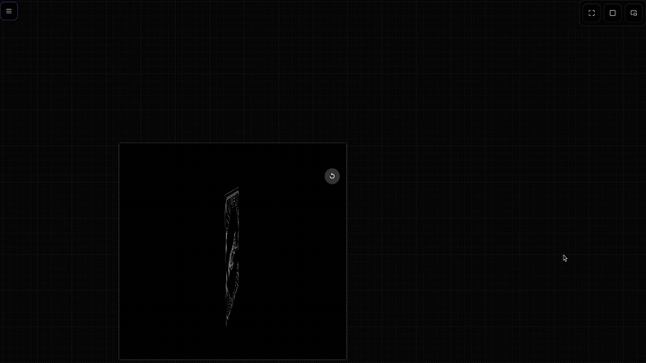

  
  
  <h1 align="center">CANVAS</h1>
  <h3 align="center"> Tʜᴇ Iɴғɪɴɪᴛᴇ Cᴀɴᴠᴀs Wᴏʀᴋsᴘᴀᴄᴇ </h3>

  <!-- TOP PURPLE LINKS -->
  
  
  
   
  <!-- BOTTOM GOLD TAXONOMY -->
  
  
  
  

  
<em>An advanced interactive canvas component that lets you create, link, and manage nodes in a zoomable, pannable infinite workspace.</em>

## Overview

Canvas (Version 2) is a visual node modeling workspace. It allows you to place custom nodes onto an infinite plane, draw connecting bezier links between them, undo or redo actions, select multiple items, and toggle between editing and pan navigations. It fully conforms to Obsidian UI themes and supports local vault save/load routines.

## Features

### Bezier Node Connection
Draw connections dynamically by dragging between output and input anchors. Bezier paths are updated in real-time as nodes are repositioned or deleted.

### Navigation Modes & Toolbar controls
Seamlessly toggle between Pan mode (hand tool) and Select mode. A persistent, blurred glassmorphism toolbar provides fast access to Undo/Redo queues, Save commands, and File browser lists.

### Workspace & State Actions
Saves full node topologies, coordinates, connections, and metadata directly inside `.datacore` settings files. Supports viewport state recovery on launch.

## Directory Index

The package exposes the following compiled files:

| File | Description |
| :--- | :--- |
| **[CANVAS.md](CANVAS.md)** | The Obsidian runner wrapper to launch the Canvas workspace. |
| **[src/index.jsx](src/index.jsx)** | Main bootstrapper and view coordinator loading index exports. |
| **[src/App.jsx](src/App.jsx)** | Coordinator containing the viewport interaction engine and controls logic. |
| **[METADATA.md](METADATA.md)** | Manifest containing taxonomy details and environment settings. |
| **[CONTRIBUTION.md](CONTRIBUTION.md)** | Development guide and core architecture pillars. |
| **[LICENSE.md](LICENSE.md)** | MIT open-source license. |

## Contributors

- beto.group
